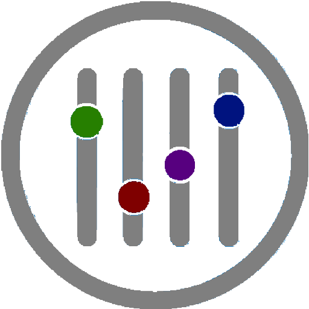

<p align="center">
    
</p>

# VSCode Settings Switcher

Define groups of settings to be easily switched and managed. These may be
defined in either global `User Settings` or your current `Workspace settings`.

This extension was largely based on the
[ericbiewener](https://github.com/ericbiewener)'s extension
[VScode Settings on Fire](https://github.com/ericbiewener/vscode-settings-on-fire).

## Command

Provides a `Switch Settings` command that can be used to switch between groups
of settings.

You can also invoke the command with arguments from a keybinding that controls
its behavior (✨ _new in v0.8.0_).

## Configuration Example

The following example shows 2 groups of settings to switch:

```jsonc
"settingsSwitcher.lists": {
    "Vertical rulers": {
        "Ruler 80": {
            "description": "Cyan ruler line at column 80",
            "editor.rulers": [{"column": 80, "color": "#4f717a" }]
        },
        "Ruler 85": {
            "description": "Yellow ruler line at column 85",
            "editor.rulers": [ { "column": 85, "color": "#615f44" }]
        },
        "Ruler 95": {
            "description": "Blue ruler line at column 95",
            "editor.rulers": [ { "column": 95, "color": "#00028a" }]
        },
    },
    "Fonts and theme": {
        "Big font dark":{
            "editor.fontSize": 18,
            "workbench.colorTheme": "Default Dark+"
        },
        "Small font light":{
            "editor.fontSize": 10,
            "workbench.colorTheme": "Default Light+"
        },
        "Big font light":{
            "editor.fontSize": 18,
            "workbench.colorTheme": "Default Light+"
        },
        "Medium font dark":{
            "editor.fontSize": 12,
            "workbench.colorTheme": "Default Dark+"
        },
    }
},
```

By running the command `Switch Settings`, the two groups of settings
`"Vertical rulers"` and `"Fonts and theme"` will appear as a list in your
command palette. So, first you select which group of settings you want to
switch.


If already set, the current configuration will appear with small font,
indicating the current state. The `"Ruler 85"` and `"Big font dark"` that you
see in the screenshot above indicates the current state of the setting. Before
ever choosing a setting, the current state will be empty.

Next, a second list will appear indicating the available settings to switch in
the chosen group. A small `"description"` property may be provided in each
configured setting and, if so, the description will appear with small font in
this second list.


You can specify any amount of settings inside each group definitions. These
settings will simply be written to your top-level settings object. For instance:
the showed example has a group of settings `"Fonts and theme"` and each
definition inside it changes the `fontSize` and the `colorTheme` together at the
same time.


## Descriptions

You may include the `"description"` key property in each setting definition to
provide more clarity around what switching the setting will do. The following
example uses a setting from the
[Python extension for Visual Studio Code](https://github.com/Microsoft/vscode-python)

```jsonc
"settingsSwitcher.lists": {
    "Arguments to run python in terminal": {
        "Normal mode": {
            "description": "No args, just run `python script.py`",
            "python.terminal.launchArgs": [""]
        },
        "Interactive mode": {
            "description": "Keep the opened terminal, run `python -i script.py`",
            "python.terminal.launchArgs": [ "-i" ]
        },
        "IPython interactive mode": {
            "description": "Use IPython module and keeps open, run `python -m IPython -i script.py`",
            "python.terminal.launchArgs": [ "-m", "IPython", "-i" ]
        },
    },
},
```


If no `"description"` is provided, it will appear as empty, like in the first
example in the group of settings `"Fonts and theme"`.

## User Settings vs Workspace settings

You can switch between groups of settings in either global `User Settings` or
your local `Workspace settings`. To do so, the setting
`"settingsSwitcher.lists"` with the groups of settings to switch must be defined
in the corresponding `settings.json` file (either global or local). The local
file (i.e., workspace settings) takes precedence.

### ✨ _new in v0.6.0_

Alternatively, you can also change which file (global or workspace) is modified
by including a `_scope` key in the defined group of settings. This key accept
the values `"global"` (or `"user"`) and `"local"` (or `"workspace"`).

## Extension Settings

This extension adds VS Code setting `"settingsSwitcher.lists"`, which may have
any amount of _groups_ of settings, each group may have a _scope_ property and
any amount of _definitions_ and each definition may have a _description_ and any
amount of _settings_. So, there are 3 levels of keys:

```jsonc
"settingsSwitcher.lists": {
    "First group of settings": {
        "_scope": "workspace",  // optional: "workspace","local" or "user","global"
        "First definition": {
            "description": "...", // optional
            [vscode settings ...] // Any amount of VSCode settings
        },
        "Second definition": {
            "description": "...", // optional
            [vscode settings ...] // Any amount of VSCode settings
        },
        "Third definition": {
            "description": "...", // optional
            [vscode settings ...] // Any amount of VSCode settings
        },
    "Second group of settings": {
        "_scope": "workspace",  // optional: "workspace","local" or "user","global"
        "First definition": {
            "description": "...", // optional
            [vscode settings ...] // Any amount of VSCode settings
        },
        "Second definition": {
            "description": "...", // optional
            [vscode settings ...] // Any amount of VSCode settings
        },
        ...
    },
    ...
},
```

## Merging vs Overwriting Settings

Settings that are objects will be merged into existing settings, while any other
type of value will simply overwrite the previous setting. For example, the
`Tests` settings below will merge the values in `files.exclude` with whatever
the current setting is for that key.

```json
"settingsSwitcher.lists": {
    "Tests": {
        "Include tests": {
            "files.exclude": {
                "**/__tests__": false,
                "**/__mocks__": false,
                "**/__fixtures__": false,
                "**/*.spec.js": false,
            }
        },
        "Exclude tests": {
            "files.exclude": {
                "**/__tests__": true,
                "**/__mocks__": true,
                "**/__fixtures__": true,
                "**/*.spec.js": true,
            }
        }
    }
}
```

## Keybindings ✨ _new in v0.8.0_

You can invoke the command `Switch Settings` with
[arguments, by adding a custom keyboard shortcut](https://code.visualstudio.com/docs/getstarted/keybindings#_command-arguments)
(with `"args"` key) to take exactly the setting you want, to cycle through the
setting list or to avoid some steps.

The `"args"` key value must be an object with 3 possible properties: `"group"`,
`"definition"` (both are Strings) and `"cycler"` (a Boolean value: `true` or
`false`).

The following is an example that creates a keybinding which applies directly the
setting definition `"Small font light"` from the group of settings
`"Fonts and theme"` of the previous configuration example:

```json
{
    "key": "ctrl+shift+alt+o",
    "command": "vscode-settings-switcher.switchSettings",
    "args": {
        "group": "Fonts and theme",
        "definition": "Small font light"
    }
}
```

If you pass the `"cycler"` property with a Boolean `true` (and don't pass a
`"definition"`), the keybinding makes the setting to _cycle_ through the
definitions list of the group (in a similar way as the
[Settings Cycler extension](https://github.com/hoovercj/vscode-api-playground/blob/master/SettingsCycler/README.md#settings-cycler)).

The following is an example of keybinding configuring a command to cycle through
setting `"editor.rulers"` in the list of definitions of the group
`"Vertical rulers"` in the previous example.

```json
{
    "key": "ctrl+shift+alt+u",
    "command": "vscode-settings-switcher.switchSettings",
    "args": {
        "group": "Vertical rulers",
        "cycler": true
    }
}
```

**Note: If you pass a `"definition"` AND the `"cycler"` property together with a
`"group"`, the `"cycler"` property, as well as the cycling behavior, is
ignored.**

Some combinations of the `"args"` properties are also possible, and they may
save some time when doing actions to change settings:

1. If you pass the args with only the `"group"` property, the keybinding will
   make the command to jump forward to open the list of definitions of that
   group in your command palette.
2. If you pass only the `"definition"` property, a first list will appear in
   your command palette showing the groups of settings to choose. Then, if you
   choose a group that has the passed definition in its list, the definition
   will be applied directly, and the the second list of the default command call
   will not appear.
3. If you pass only the `"cycler"` property with Boolean `true`, the first list
   will appear in your command palette, showing the groups of settings to
   choose, but the settings will cycle through the definitions of any chosen
   group, applying the cycling behavior. So, the the second list of the default
   command call will not appear.
4. If you pass the `"definition"` and the `"cycler"` properties, a first list
   will appear in your command palette showing the groups of settings to choose.
   Then, if you choose a group that has the passed definition in its list, the
   definition will be applied directly. If not, the settings will cycle through
   the definitions of any other chosen group. Because of that, the second list
   of the default command call will not appear.

## Credits

The code of this extension was largely based on the
[ericbiewener](https://github.com/ericbiewener)'s extension
[VScode Settings on Fire](https://github.com/ericbiewener/vscode-settings-on-fire).
